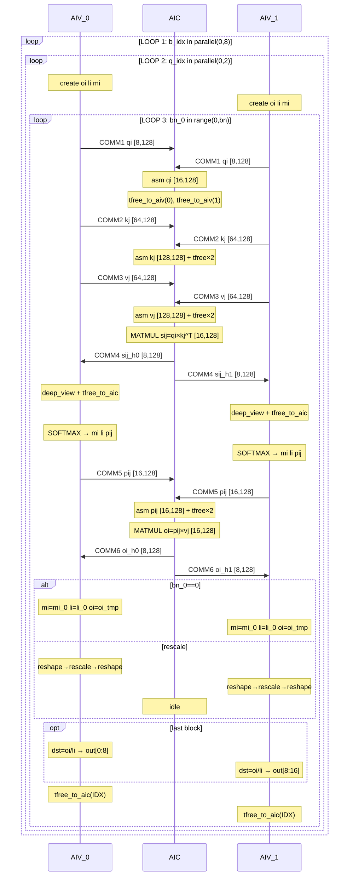

# PagedAttention Kernel Flow Analysis (pa4, Pass 08)

## Overview

The `ExpandMixedKernel` pass splits the original mixed InCore kernel into three co-scheduled kernels running on one AIC (Cube) core and two AIV (Vector) cores. This document traces the data flow through all three kernels within one block iteration (`bn_0`), showing the tpush/tpop/tfree correspondence.

**Kernel signatures:**

| Kernel | Core | Instances | Tensor sizes |
|--------|------|-----------|-------------|
| `paged_attention_incore_0_aic` | AIC (Cube) | 1× | Full-size: `[16, 128]`, `[128, 128]` |
| `paged_attention_incore_0_aiv` (AIV_IDX=0) | AIV (Vector 0) | 1× | Half-size: `[8, 128]`, `[64, 128]` |
| `paged_attention_incore_0_aiv` (AIV_IDX=1) | AIV (Vector 1) | 1× | Half-size: `[8, 128]`, `[64, 128]` |

**Communication protocol:** Each data transfer uses a 3-step split consumer protocol:
1. **tpush** — producer sends data into ring buffer slot
2. **tpop** — consumer acquires slot, loads data (slot remains **held**)
3. **tfree** — consumer releases slot after finishing all reads

---

## Side-by-Side Kernel Flow with Loop Boundaries

Three kernels run concurrently on one cluster. Each kernel has identical 3-level loop nesting.
They synchronize via **6 tpush/tpop pairs** inside the innermost loop, each paired with a
corresponding **tfree** after the consumer finishes reading. `COMM N` labels mark
send/receive across columns. `FREE N` labels mark slot release.

```
   AIV_0 (Vector 0)             │        AIC (Cube)              │   AIV_1 (Vector 1)
═════════════════════════════════╪═════════════════════════════════╪═════════════════════════════════
 init_pipe()                    │ init_pipe()                     │ init_pipe()
                                │                                 │
═══ LOOP 1 START ═══════════════╪═════════════════════════════════╪═════════════════════════════════
 FOR b_idx IN parallel(0, 8)    │ FOR b_idx IN parallel(0, 8)     │ FOR b_idx IN parallel(0, 8)
                                │                                 │
 ══ LOOP 2 START ═══════════════╪═════════════════════════════════╪═════════════════════════════════
  FOR q_idx IN parallel(0, 2)   │ FOR q_idx IN parallel(0, 2)     │ FOR q_idx IN parallel(0, 2)
                                │                                 │
  cur_seq = read(ctx_lens)      │ cur_seq = read(ctx_lens)        │ cur_seq = read(ctx_lens)
  bn = ceildiv(cur_seq, 128)    │ bn = ceildiv(cur_seq, 128)      │ bn = ceildiv(cur_seq, 128)
  oi = create [8,128] FP32     │                                 │ oi = create [8,128] FP32
  li = create [8,1] FP32       │                                 │ li = create [8,1] FP32
  mi = create [8,1] FP32       │                                 │ mi = create [8,1] FP32
                                │                                 │
  ═ LOOP 3 START ═══════════════╪═════════════════════════════════╪═════════════════════════════════
   FOR bn_0 IN range(0, bn)     │ FOR bn_0 IN range(0, bn)        │ FOR bn_0 IN range(0, bn)
   carry: li, mi, oi, out       │ carry: out                       │ carry: li, mi, oi, out
  ──────────────────────────────┼─────────────────────────────────┼─────────────────────────────────
                                │                                 │
   qi = view(query, [8,128])    │                                 │ qi = view(query, [8,128])
   tpush_to_aic(qi, 0)  COMM 1→│ ←tpop(0)  qi_h0 [8,128]        │←COMM 1  tpush_to_aic(qi, 1)
                                │ ←tpop(1)  qi_h1 [8,128]        │
                                │ asm(qi_h0) → qi_mid             │
                                │ tfree_to_aiv(0)         FREE 1a │
                                │ asm(qi_h1) → qi [16,128]        │
                                │ tfree_to_aiv(1)         FREE 1b │
                                │                                 │
   kj = view(key, [64,128])     │                                 │ kj = view(key, [64,128])
   tpush_to_aic(kj, 0)  COMM 2→│ ←tpop(0)+tpop(1)               │←COMM 2  tpush_to_aic(kj, 1)
                                │ asm(kj_h0) + tfree(0)   FREE 2a │
                                │ asm(kj_h1) → kj [128,128]       │
                                │ tfree_to_aiv(1)         FREE 2b │
                                │                                 │
   vj = view(val, [64,128])     │                                 │ vj = view(val, [64,128])
   tpush_to_aic(vj, 0)  COMM 3→│ ←tpop(0)+tpop(1)               │←COMM 3  tpush_to_aic(vj, 1)
                                │ asm(vj_h0) + tfree(0)   FREE 3a │
                                │ asm(vj_h1) → vj [128,128]       │
                                │ tfree_to_aiv(1)         FREE 3b │
                                │                                 │
                                │ sij = matmul(qi, kj^T)          │
                                │   → [16,128]                    │
                                │ h0 = view(sij,[8,128],[0,0])    │
                                │ h1 = view(sij,[8,128],[8,0])    │
   tpop sij [8,128]   ←COMM 4  │ tpush_to_aiv(h0, 0)    COMM 4→ │ tpop sij [8,128]   ←COMM 4
                                │ tpush_to_aiv(h1, 1)    COMM 4→ │
                                │                                 │
   SOFTMAX:                     │                                 │ SOFTMAX:
     deep_view(sij, [8,vlen])   │                                 │   deep_view(sij, [8,vlen])
     tfree_to_aic(IDX)  FREE 4  │                                 │   tfree_to_aic(IDX)  FREE 4
     scaled = mul(sij_v, scale) │                                 │   scaled = mul(sij_v, scale)
     mi_0 = row_max(scaled)     │                                 │   mi_0 = row_max(scaled)
     centered = sub(scaled,mi_0)│                                 │   centered = sub(scaled,mi_0)
     exp_v = exp(centered)      │                                 │   exp_v = exp(centered)
     pij_bf = cast(exp_v, BF16) │                                 │   pij_bf = cast(exp_v, BF16)
     pij_fp = cast(pij_bf,FP32) │                                 │   pij_fp = cast(pij_bf,FP32)
     li_0 = row_sum(pij_fp)     │                                 │   li_0 = row_sum(pij_fp)
     asm pij_f16 [16,128]       │                                 │   asm pij_f16 [16,128]
                                │                                 │
   tpush(pij, 0)        COMM 5→│ ←tpop(0)+tpop(1)               │←COMM 5  tpush(pij, 1)
                                │ asm(pij_h0) + tfree(0)  FREE 5a │
                                │ asm(pij_h1) → pij [16,128]      │
                                │ tfree_to_aiv(1)         FREE 5b │
                                │                                 │
                                │ oi = matmul(pij, vj)            │
                                │   → [16,128]                    │
                                │ h0 = view(oi,[8,128],[0,0])     │
                                │ h1 = view(oi,[8,128],[8,0])     │
   tpop oi_tmp [8,128] ←COMM 6 │ tpush_to_aiv(h0, 0)    COMM 6→ │ tpop oi_tmp [8,128] ←COMM 6
                                │ tpush_to_aiv(h1, 1)    COMM 6→ │
  ──────────────────────────────┼─────────────────────────────────┼─────────────────────────────────
   IF bn_0 == 0:                │                                 │ IF bn_0 == 0:
     mi = mi_0                  │         (idle)                  │   mi = mi_0
     li = li_0                  │                                 │   li = li_0
     oi = oi_tmp                │                                 │   oi = oi_tmp
   ELSE:  ── online rescale ──  │                                 │ ELSE:  ── online rescale ──
     deep_reshape [8,1]→[1,8]   │                                 │   deep_reshape [8,1]→[1,8]
     mi_new = max(mi_prev, mij) │                                 │   mi_new = max(mi_prev, mij)
     α = exp(mi_prev - mi_new)  │         (idle)                  │   α = exp(mi_prev - mi_new)
     β = exp(mij - mi_new)      │                                 │   β = exp(mij - mi_new)
     li_new = α*li + β*lij      │                                 │   li_new = α*li + β*lij
     deep_reshape [1,8]→[8,1]   │                                 │   deep_reshape [1,8]→[8,1]
     oi_upd = α*oi + β*oi_tmp   │                                 │   oi_upd = α*oi + β*oi_tmp
   ENDIF                        │                                 │ ENDIF
  ──────────────────────────────┼─────────────────────────────────┼─────────────────────────────────
   IF is_last_block:            │                                 │ IF is_last_block:
     dst = div(oi, li) [8,128]  │         (idle)                  │   dst = div(oi, li) [8,128]
     asm → out[off:off+8, :]    │                                 │   asm → out[off+8:off+16, :]
   ENDIF                        │                                 │ ENDIF
  ──────────────────────────────┼─────────────────────────────────┼─────────────────────────────────
   tfree_to_aic(IDX)    FREE 6  │                                 │ tfree_to_aic(IDX)    FREE 6
   yield: li, mi, oi, out       │ yield: out                       │ yield: li, mi, oi, out
                                │                                 │
  ═ LOOP 3 END ═════════════════╪═════════════════════════════════╪═════════════════════════════════
   END FOR bn_0                  │ END FOR bn_0                     │ END FOR bn_0
                                │                                 │
 ══ LOOP 2 END ═════════════════╪═════════════════════════════════╪═════════════════════════════════
  END FOR q_idx                  │ END FOR q_idx                    │ END FOR q_idx
                                │                                 │
═══ LOOP 1 END ═════════════════╪═════════════════════════════════╪═════════════════════════════════
 END FOR b_idx                   │ END FOR b_idx                    │ END FOR b_idx
```

### Cross-Kernel Communication Summary (per bn_0 iteration)

```
 COMM  Direction    AIV (each core)              AIC                           Var         Shape          tfree placement
 ────  ─────────    ────────────────────────     ──────────────────────────    ──────────  ─────────────  ───────────────────────
  1    AIV → AIC    tpush(qi_0, IDX)             tpop×2 + asm + tfree×2       qi_0        [8,128]→[16]   AIC: after each assemble
  2    AIV → AIC    tpush(kj_0, IDX)             tpop×2 + asm + tfree×2       kj_0        [64,128]→[128] AIC: after each assemble
  3    AIV → AIC    tpush(vj_0, IDX)             tpop×2 + asm + tfree×2       vj_0        [64,128]→[128] AIC: after each assemble
  4    AIC → AIV    tpop(IDX) → sij_0            view+split + tpush×2         sij_0       [16,128]→[8]   AIV: after deep_view
  5    AIV → AIC    tpush(pij_f16_1, IDX)        tpop×2 + asm + tfree×2       pij_f16_1   [16,128]→[16]  AIC: after each assemble
  6    AIC → AIV    tpop(IDX) → oi_tmp_0         view+split + tpush×2         oi_tmp_0    [16,128]→[8]   AIV: after rescale/output
```

---

## Detailed Operation Trace

### Communication Transfer Table

| # | Direction | Variable | AIV Shape | AIC Shape | Description | tfree |
|---|-----------|----------|-----------|-----------|-------------|-------|
| 1 | AIV→AIC | `qi_0` | `[8, 128]` BF16 | `[16, 128]` BF16 | Query tile (split axis 0) | AIC: `tfree_to_aiv(0)` after asm h0, `tfree_to_aiv(1)` after asm h1 |
| 2 | AIV→AIC | `kj_0` | `[64, 128]` BF16 | `[128, 128]` BF16 | Key block (split axis 0) | AIC: `tfree_to_aiv(0/1)` after respective assemble |
| 3 | AIV→AIC | `vj_0` | `[64, 128]` BF16 | `[128, 128]` BF16 | Value block (split axis 0) | AIC: `tfree_to_aiv(0/1)` after respective assemble |
| 4 | AIC→AIV | `sij_0` | `[8, 128]` BF16 | `[16, 128]` BF16 | Q·K^T matmul result | AIV: `tfree_to_aic(IDX)` after `deep_view` |
| 5 | AIV→AIC | `pij_f16_1` | `[16, 128]` BF16 | `[16, 128]` BF16 | Softmax output (padded) | AIC: `tfree_to_aiv(0/1)` after respective assemble |
| 6 | AIC→AIV | `oi_tmp_0` | `[8, 128]` BF16 | `[16, 128]` BF16 | P·V matmul result | AIV: `tfree_to_aic(IDX)` after all if/else rescaling branches |

### AIC Kernel — Detailed Operations (inner loop body)

```
 Step  Operation                          Output Shape         Slot lifecycle
 ────  ─────────────────────────────────  ──────────────────   ──────────────
  1    tpop_from_aiv(0)                   qi_0__h0 [8,128]     ▶ slot held
  2    tpop_from_aiv(1)                   qi_0__h1 [8,128]     ▶ slot held
  3    create([16,128])                   qi_0__tmp [16,128]
  4    assemble(tmp, h0, [0,0])           qi_0__mid [16,128]
  5    tfree_to_aiv(0)                    ─                    ◀ slot 0 released
  6    assemble(mid, h1, [8,0])           qi_0 [16,128]
  7    tfree_to_aiv(1)                    ─                    ◀ slot 1 released
  8    tpop_from_aiv(0)                   kj_0__h0 [64,128]    ▶ slot held
  9    tpop_from_aiv(1)                   kj_0__h1 [64,128]    ▶ slot held
 10    create+assemble                    kj_0__mid
 11    tfree_to_aiv(0)                    ─                    ◀ slot 0 released
 12    assemble → kj_0 [128,128]
 13    tfree_to_aiv(1)                    ─                    ◀ slot 1 released
 14    tpop_from_aiv(0)                   vj_0__h0 [64,128]    ▶ slot held
 15    tpop_from_aiv(1)                   vj_0__h1 [64,128]    ▶ slot held
 16    create+assemble                    vj_0__mid
 17    tfree_to_aiv(0)                    ─                    ◀ slot 0 released
 18    assemble → vj_0 [128,128]
 19    tfree_to_aiv(1)                    ─                    ◀ slot 1 released
 20    matmul(qi_0, kj_0, b_trans=T)      sij_0 [16,128]
 21    view(sij_0, [8,128], [0,0])        __half0__ [8,128]
 22    view(sij_0, [8,128], [8,0])        __half1__ [8,128]
 23    tpush_to_aiv(__half0__, 0)          ─
 24    tpush_to_aiv(__half1__, 1)          ─
 25    tpop_from_aiv(0)                   pij_h0 [8,128]       ▶ slot held
 26    tpop_from_aiv(1)                   pij_h1 [8,128]       ▶ slot held
 27    create+assemble                    pij_mid
 28    tfree_to_aiv(0)                    ─                    ◀ slot 0 released
 29    assemble → pij_f16_1 [16,128]
 30    tfree_to_aiv(1)                    ─                    ◀ slot 1 released
 31    matmul(pij_f16_1, vj_0)            oi_tmp_0 [16,128]
 32    view(oi_tmp_0, [8,128], [0,0])     __half0__ [8,128]
 33    view(oi_tmp_0, [8,128], [8,0])     __half1__ [8,128]
 34    tpush_to_aiv(__half0__, 0)          ─
 35    tpush_to_aiv(__half1__, 1)          ─
```

### AIV Kernel (AIV_IDX=0 or 1) — Detailed Operations (inner loop body)

```
 Step  Operation                             Output Shape       Slot lifecycle
 ────  ────────────────────────────────────  ────────────────   ──────────────
  1    view(query_0, [8,128], [...+IDX*8])   qi_0 [8,128]
  2    tpush_to_aic(qi_0, AIV_IDX)           ─
  3    view(key_cache_0, [64,128], [...])     kj_0 [64,128]
  4    tpush_to_aic(kj_0, AIV_IDX)           ─
  5    view(value_cache_0, [64,128], [...])   vj_0 [64,128]
  6    tpush_to_aic(vj_0, AIV_IDX)           ─
  7    tpop_from_aic(AIV_IDX)                sij_0 [8,128]      ▶ slot held
  8    deep_view(sij_0, [8,valid_len])       sij_valid_0
  9    tfree_to_aic(AIV_IDX)                 ─                  ◀ slot released
 10    mul(sij_valid_0, scale)               scaled_0
 11    row_max(scaled_0)                     mi_0 [8,1]
 12    sub(scaled_0, mi_0)                   sij_centered_0
 13    exp(sij_centered_0)                   exp_vals_0
 14    cast(exp_vals_0, BF16)                pij_bf16_0
 15    cast(pij_bf16_0, FP32)                pij_0
 16    row_sum(pij_0)                        li_0 [8,1]
 17    create([8,128])                       pij_f16_0
 18    assemble(pij_f16_0, pij_bf16_0)       pij_f16_1 [16,128]
 19    tpush_to_aic(pij_f16_1, AIV_IDX)      ─
 20    tpop_from_aic(AIV_IDX)                oi_tmp_0 [8,128]   ▶ slot held

  ── Predicate: IF bn_0 == 0 ──

 21    mi = mi_0, li = li_0, oi = oi_tmp

  ── Predicate: ELSE — Online Rescaling (bn_0 > 0) ──

 22    deep_reshape(mi_update_iter, [1,8])   mi_prev_nd [1,8]
 23    deep_reshape(mi_0, [1,8])             mij_nd [1,8]
 24    deep_reshape(li_update_iter, [1,8])   li_prev_nd [1,8]
 25    deep_reshape(li_0, [1,8])             lij_nd [1,8]
 26    maximum(mi_prev_nd, mij_nd)           mi_new [1,8]
 27    sub(mi_prev_nd, mi_new)               mi_diff [1,8]
 28    exp(mi_diff)                          alpha [1,8]
 29    sub(mij_nd, mi_new)                   mij_diff [1,8]
 30    exp(mij_diff)                         beta [1,8]
 31    mul(alpha, li_prev_nd)                li_scaled [1,8]
 32    mul(beta, lij_nd)                     lij_scaled [1,8]
 33    add(li_scaled, lij_scaled)            li_new [1,8]
 34    deep_reshape(alpha, [8,1])            alpha_dn [8,1]
 35    mul(oi_iter, alpha_dn)                oi_scaled [8,128]
 36    deep_reshape(beta, [8,1])             beta_dn [8,1]
 37    mul(oi_tmp, beta_dn)                  oi_new_sc [8,128]   ← last use of oi_tmp
 38    add(oi_scaled, oi_new_scaled)         oi_updated [8,128]

  ── Predicate: IF is_last_block ──

 39    deep_reshape(li_new, [8,1])           li_new_dn [8,1]
 40    div(oi_updated, li_new_dn)            dst [8,128]
 41    assemble(out, dst, [...+IDX*8])       out [4096,128]

  ── ENDIF (both branches) ──

 42    tfree_to_aic(AIV_IDX)                 ─                  ◀ slot released
 43    yield: li, mi, oi, out
```

---

## Split Axis Summary

The `deep_reshape` operations act as **chain boundaries**, enabling three independent split strategies:

```
 Chain A (softmax + data loading):  [16,X] / [128,X] → SPLIT axis 0
 ┌──────────────────────────────────────────────────────────────────┐
 │ qi_0, kj_0, vj_0, sij_0, sij_valid_0, scaled_0, mi_0,         │
 │ sij_centered_0, exp_vals_0, pij_bf16_0, pij_0, li_0,           │
 │ pij_f16_0, pij_f16_1, oi_tmp_0, dst, oi_scaled, oi_updated,   │
 │ alpha_dn, beta_dn, mi_update_4, li_update_4, li_new_dn, dst_1 │
 └──────────────────────────────────────────────────────────────────┘
                              ↕ deep_reshape (chain boundary)
 Chain B (rescaling [1,16]):  [1,16] → SPLIT axis 1
 ┌──────────────────────────────────────────────────────────────────┐
 │ mi_prev_nd, mij_nd, li_prev_nd, lij_nd, mi_new, mi_diff,       │
 │ alpha, mij_diff, beta, li_scaled, lij_scaled, li_new            │
 └──────────────────────────────────────────────────────────────────┘
                              ↕ deep_reshape (chain boundary)
 Chain C (merged with A):  [16,X] → SPLIT axis 0
 (alpha_dn, beta_dn, oi_scaled, oi_new_scaled, oi_updated, etc.)
```

**Result: 0 duplicated variables, 50 split variables across 17 chains.**

---

## Mermaid Sequence Diagram



---

## Ring Buffer Slot Lifetime Analysis

Each tpop/tfree pair defines the **slot hold duration** — the time a ring buffer slot is unavailable to the producer.

| COMM | Consumer | tpop (acquire) | tfree (release) | Held across |
|------|----------|----------------|-----------------|-------------|
| 1a | AIC | `tpop_from_aiv(0)` qi_h0 | `tfree_to_aiv(0)` | 1 assemble |
| 1b | AIC | `tpop_from_aiv(1)` qi_h1 | `tfree_to_aiv(1)` | 2 assembles |
| 2a | AIC | `tpop_from_aiv(0)` kj_h0 | `tfree_to_aiv(0)` | 1 assemble |
| 2b | AIC | `tpop_from_aiv(1)` kj_h1 | `tfree_to_aiv(1)` | 2 assembles |
| 3a | AIC | `tpop_from_aiv(0)` vj_h0 | `tfree_to_aiv(0)` | 1 assemble |
| 3b | AIC | `tpop_from_aiv(1)` vj_h1 | `tfree_to_aiv(1)` | 2 assembles |
| 4 | AIV | `tpop_from_aic(IDX)` sij | `tfree_to_aic(IDX)` | 1 deep_view |
| 5a | AIC | `tpop_from_aiv(0)` pij_h0 | `tfree_to_aiv(0)` | 1 assemble |
| 5b | AIC | `tpop_from_aiv(1)` pij_h1 | `tfree_to_aiv(1)` | 2 assembles |
| 6 | AIV | `tpop_from_aic(IDX)` oi_tmp | `tfree_to_aic(IDX)` | if/else rescale + output |

**Key observation:** COMM 6 (`oi_tmp_0`) has the longest slot hold duration because `oi_tmp_0` is used across both branches of the `if is_first_0 / else` rescaling logic. The `tfree_to_aic(AIV_IDX)` is placed after the entire if/else block to ensure data integrity.

---

## Memory Allocation Summary

| Tensor | AIC Size | AIV Size (per core) | Total per iteration |
|--------|----------|---------------------|---------------------|
| qi_0 | 4096B (16×128×BF16) | 2048B (8×128×BF16) | 8192B |
| kj_0 | 32768B (128×128×BF16) | 16384B (64×128×BF16) | 65536B |
| vj_0 | 32768B (128×128×BF16) | 16384B (64×128×BF16) | 65536B |
| sij_0 | 4096B (16×128×BF16) | 2048B (8×128×BF16) | 8192B |
| pij_f16_1 | 4096B (16×128×BF16) | 4096B (16×128×BF16) | 12288B |
| oi_tmp_0 | 4096B (16×128×BF16) | 2048B (8×128×BF16) | 8192B |
| rescaling intermediates | — | ~32B × 12 vars | ~768B |

**Key insight:** With dual-core splitting, each AIV core processes half the rows, effectively doubling the vector compute throughput for the softmax and rescaling operations while the AIC handles the matrix multiplications. The split consumer protocol (tpop/tfree) ensures ring buffer slots are held only as long as the data is actively being read.
