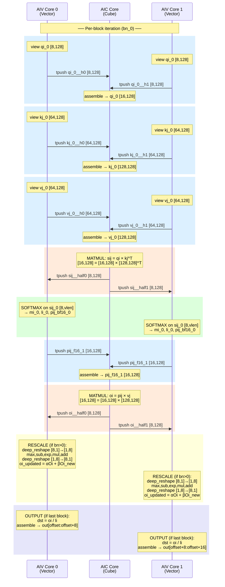

# PagedAttention Kernel Flow Analysis (pa4, Pass 13)

## Overview

The `ExpandMixedKernel` pass splits the original mixed InCore kernel into three co-scheduled kernels running on one AIC (Cube) core and two AIV (Vector) cores. This document traces the data flow through all three kernels within one block iteration (`bn_0`), showing the tpush/tpop correspondence.

**Kernel signatures:**

| Kernel | Core | Instances | Tensor sizes |
|--------|------|-----------|-------------|
| `paged_attention_incore_0_aic` | AIC (Cube) | 1× | Full-size: `[16, 128]`, `[128, 128]` |
| `paged_attention_incore_0_aiv` (AIV_IDX=0) | AIV (Vector 0) | 1× | Half-size: `[8, 128]`, `[64, 128]` |
| `paged_attention_incore_0_aiv` (AIV_IDX=1) | AIV (Vector 1) | 1× | Half-size: `[8, 128]`, `[64, 128]` |

---

## Communication Flow (per bn_0 iteration)

There are **6 cross-core transfers** per block iteration, alternating between AIV→AIC and AIC→AIV:

```
   AIV_0 (Vector 0)              AIC (Cube)               AIV_1 (Vector 1)
   ═══════════════              ══════════                 ═══════════════
         │                           │                           │
   ┌─────┴─────┐                     │                     ┌─────┴─────┐
   │ view qi_0 │                     │                     │ view qi_0 │
   │ [8, 128]  │                     │                     │ [8, 128]  │
   └─────┬─────┘                     │                     └─────┬─────┘
         │                           │                           │
  ──── COMM 1: qi (AIV→AIC) ─────────────────────────────────────────
         │  tpush_to_aic(qi_0, 0)    │    tpush_to_aic(qi_0, 1)  │
         ├──────────────────────────►│◄──────────────────────────┤
         │                     ┌─────┴─────┐                     │
         │                     │ tpop h0+h1│                     │
         │                     │ assemble  │                     │
         │                     │ qi_0      │                     │
         │                     │ [16, 128] │                     │
         │                     └─────┬─────┘                     │
   ┌─────┴─────┐                     │                     ┌─────┴─────┐
   │ view kj_0 │                     │                     │ view kj_0 │
   │ [64, 128] │                     │                     │ [64, 128] │
   └─────┬─────┘                     │                     └─────┬─────┘
         │                           │                           │
  ──── COMM 2: kj (AIV→AIC) ─────────────────────────────────────────
         │  tpush_to_aic(kj_0, 0)    │    tpush_to_aic(kj_0, 1)  │
         ├──────────────────────────►│◄──────────────────────────┤
         │                     ┌─────┴─────┐                     │
         │                     │ tpop h0+h1│                     │
         │                     │ assemble  │                     │
         │                     │ kj_0      │                     │
         │                     │[128, 128] │                     │
         │                     └─────┬─────┘                     │
   ┌─────┴─────┐                     │                     ┌─────┴─────┐
   │ view vj_0 │                     │                     │ view vj_0 │
   │ [64, 128] │                     │                     │ [64, 128] │
   └─────┬─────┘                     │                     └─────┬─────┘
         │                           │                           │
  ──── COMM 3: vj (AIV→AIC) ─────────────────────────────────────────
         │  tpush_to_aic(vj_0, 0)    │    tpush_to_aic(vj_0, 1)  │
         ├──────────────────────────►│◄──────────────────────────┤
         │                     ┌─────┴─────┐                     │
         │                     │ tpop h0+h1│                     │
         │                     │ assemble  │                     │
         │                     │ vj_0      │                     │
         │                     │[128, 128] │                     │
         │                     └─────┬─────┘                     │
         │                     ┌─────┴─────┐                     │
         │                     │ MATMUL 1  │                     │
         │                     │ sij = qi  │                     │
         │                     │   × kj^T  │                     │
         │                     │ [16, 128] │                     │
         │                     └─────┬─────┘                     │
         │                     ┌─────┴─────┐                     │
         │                     │ split sij │                     │
         │                     │ half0=[8,128] │                 │
         │                     │ half1=[8,128] │                 │
         │                     └─────┬─────┘                     │
         │                           │                           │
  ──── COMM 4: sij (AIC→AIV) ────────────────────────────────────────
         │                           │                           │
         │◄────tpush_to_aiv(h0, 0)───┤───tpush_to_aiv(h1, 1)──►│
         │                           │                           │
   ┌─────┴──────────┐                │                ┌──────────┴─────┐
   │ tpop sij_0     │                │                │ tpop sij_0     │
   │ [8, 128]       │                │                │ [8, 128]       │
   │                │                │                │                │
   │ ── SOFTMAX ──  │                │                │ ── SOFTMAX ──  │
   │ deep_view      │                │                │ deep_view      │
   │ mul(scale)     │                │                │ mul(scale)     │
   │ row_max → mi_0 │                │                │ row_max → mi_0 │
   │ sub(scaled,mi) │                │                │ sub(scaled,mi) │
   │ exp            │                │                │ exp            │
   │ cast(bf16)     │                │                │ cast(bf16)     │
   │ cast(fp32)     │                │                │ cast(fp32)     │
   │ row_sum → li_0 │                │                │ row_sum → li_0 │
   │                │                │                │                │
   │ assemble pij   │                │                │ assemble pij   │
   │ pij_f16_1      │                │                │ pij_f16_1      │
   │ [16, 128]      │                │                │ [16, 128]      │
   └─────┬──────────┘                │                └──────────┬─────┘
         │                           │                           │
  ──── COMM 5: pij (AIV→AIC) ────────────────────────────────────────
         │  tpush_to_aic(pij, 0)     │    tpush_to_aic(pij, 1)  │
         ├──────────────────────────►│◄──────────────────────────┤
         │                     ┌─────┴─────┐                     │
         │                     │ tpop h0+h1│                     │
         │                     │ assemble  │                     │
         │                     │ pij_f16_1 │                     │
         │                     │ [16, 128] │                     │
         │                     └─────┬─────┘                     │
         │                     ┌─────┴─────┐                     │
         │                     │ MATMUL 2  │                     │
         │                     │ oi = pij  │                     │
         │                     │   × vj    │                     │
         │                     │ [16, 128] │                     │
         │                     └─────┬─────┘                     │
         │                     ┌─────┴─────┐                     │
         │                     │ split oi  │                     │
         │                     │ half0=[8,128] │                 │
         │                     │ half1=[8,128] │                 │
         │                     └─────┬─────┘                     │
         │                           │                           │
  ──── COMM 6: oi_tmp (AIC→AIV) ─────────────────────────────────────
         │                           │                           │
         │◄────tpush_to_aiv(h0, 0)───┤───tpush_to_aiv(h1, 1)──►│
         │                           │                           │
   ┌─────┴──────────┐                │                ┌──────────┴─────┐
   │ tpop oi_tmp_0  │                │                │ tpop oi_tmp_0  │
   │ [8, 128]       │                │                │ [8, 128]       │
   │                │                │                │                │
   │ ── RESCALE ──  │           (AIC idle)            │ ── RESCALE ──  │
   │ (if bn_0 > 0): │                │                │ (if bn_0 > 0): │
   │ deep_reshape   │                │                │ deep_reshape   │
   │  [8,1]→[1,8]  │                │                │  [8,1]→[1,8]  │
   │ maximum,sub,   │                │                │ maximum,sub,   │
   │ exp,mul,add    │                │                │ exp,mul,add    │
   │ deep_reshape   │                │                │ deep_reshape   │
   │  [1,8]→[8,1]  │                │                │  [1,8]→[8,1]  │
   │ mul,mul,add    │                │                │ mul,mul,add    │
   │ → oi_updated   │                │                │ → oi_updated   │
   │                │                │                │                │
   │ ── OUTPUT ──   │                │                │ ── OUTPUT ──   │
   │ (if last block):│                │               │ (if last block):│
   │ div(oi, li)    │                │                │ div(oi, li)    │
   │ assemble→out   │                │                │ assemble→out   │
   └────────────────┘                │                └────────────────┘
```

---

## Detailed Operation Trace

### Communication Transfer Table

| # | Direction | Variable | AIV Shape | AIC Shape | Description |
|---|-----------|----------|-----------|-----------|-------------|
| 1 | AIV→AIC | `qi_0` | `[8, 128]` BF16 | `[16, 128]` BF16 | Query tile (split on axis 0) |
| 2 | AIV→AIC | `kj_0` | `[64, 128]` BF16 | `[128, 128]` BF16 | Key block (split on axis 0) |
| 3 | AIV→AIC | `vj_0` | `[64, 128]` BF16 | `[128, 128]` BF16 | Value block (split on axis 0) |
| 4 | AIC→AIV | `sij_0` | `[8, 128]` BF16 | `[16, 128]` BF16 | Q·K^T matmul result |
| 5 | AIV→AIC | `pij_f16_1` | `[16, 128]` BF16 | `[16, 128]` BF16 | Softmax output (padded) |
| 6 | AIC→AIV | `oi_tmp_0` | `[8, 128]` BF16 | `[16, 128]` BF16 | P·V matmul result |

### AIC Kernel — Detailed Operations (inner loop body)

```
 Step  Operation                          Output Shape         Memory
 ────  ─────────────────────────────────  ──────────────────   ──────
  1    tpop_from_aiv(0)                   qi_0__h0 [8,128]     2048B
  2    tpop_from_aiv(1)                   qi_0__h1 [8,128]     2048B
  3    create([16,128])                   qi_0__tmp [16,128]   4096B
  4    assemble(tmp, h0, [0,0])           qi_0__mid [16,128]   4096B
  5    assemble(mid, h1, [8,0])           qi_0 [16,128]        4096B
  6    tpop_from_aiv(0)                   kj_0__h0 [64,128]   16384B
  7    tpop_from_aiv(1)                   kj_0__h1 [64,128]   16384B
  8    create+assemble                    kj_0 [128,128]      32768B
  9    tpop_from_aiv(0)                   vj_0__h0 [64,128]   16384B
 10    tpop_from_aiv(1)                   vj_0__h1 [64,128]   16384B
 11    create+assemble                    vj_0 [128,128]      32768B
 12    matmul(qi_0, kj_0, b_trans=True)   sij_0 [16,128]       4096B
 13    view(sij_0, [8,128], [0,0])        __half0__ [8,128]    2048B
 14    view(sij_0, [8,128], [8,0])        __half1__ [8,128]    2048B
 15    tpush_to_aiv(__half0__, 0)          ─                    ─
 16    tpush_to_aiv(__half1__, 1)          ─                    ─
 17    tpop_from_aiv(0)                   pij_h0 [8,128]       2048B
 18    tpop_from_aiv(1)                   pij_h1 [8,128]       2048B
 19    create+assemble                    pij_f16_1 [16,128]   4096B
 20    matmul(pij_f16_1, vj_0)            oi_tmp_0 [16,128]    4096B
 21    view(oi_tmp_0, [8,128], [0,0])     __half0__ [8,128]    2048B
 22    view(oi_tmp_0, [8,128], [8,0])     __half1__ [8,128]    2048B
 23    tpush_to_aiv(__half0__, 0)          ─                    ─
 24    tpush_to_aiv(__half1__, 1)          ─                    ─
```

### AIV Kernel (AIV_IDX=0 or 1) — Detailed Operations (inner loop body)

```
 Step  Operation                             Output Shape       Split
 ────  ────────────────────────────────────  ────────────────   ─────
  1    view(query_0, [8,128], [...+IDX*8])   qi_0 [8,128]      axis0
  2    tpush_to_aic(qi_0, AIV_IDX)           ─                  ─
  3    view(key_cache_0, [64,128], [...])     kj_0 [64,128]     axis0
  4    tpush_to_aic(kj_0, AIV_IDX)           ─                  ─
  5    view(value_cache_0, [64,128], [...])   vj_0 [64,128]     axis0
  6    tpush_to_aic(vj_0, AIV_IDX)           ─                  ─
  7    tpop_from_aic(AIV_IDX)                sij_0 [8,128]      axis0
  8    deep_view(sij_0, [8,valid_len])       sij_valid_0        axis0
  9    mul(sij_valid_0, scale)               scaled_0           axis0
 10    row_max(scaled_0)                     mi_0 [8,1]         axis0
 11    sub(scaled_0, mi_0)                   sij_centered_0     axis0
 12    exp(sij_centered_0)                   exp_vals_0         axis0
 13    cast(exp_vals_0, BF16)                pij_bf16_0         axis0
 14    cast(pij_bf16_0, FP32)                pij_0              axis0
 15    row_sum(pij_0)                        li_0 [8,1]         axis0
 16    create([8,128])                       pij_f16_0          axis0
 17    assemble(pij_f16_0, pij_bf16_0)       pij_f16_1 [16,128] ─
 18    tpush_to_aic(pij_f16_1, AIV_IDX)      ─                  ─
 19    tpop_from_aic(AIV_IDX)                oi_tmp_0 [8,128]   axis0

  ── Online Rescaling (bn_0 > 0, else branch) ──

 20    deep_reshape(mi_update_iter, [1,8])   mi_prev_nd [1,8]   axis1
 21    deep_reshape(mi_0, [1,8])             mij_nd [1,8]       axis1
 22    deep_reshape(li_update_iter, [1,8])   li_prev_nd [1,8]   axis1
 23    deep_reshape(li_0, [1,8])             lij_nd [1,8]       axis1
 24    maximum(mi_prev_nd, mij_nd)           mi_new [1,8]       axis1
 25    sub(mi_prev_nd, mi_new)               mi_diff [1,8]      axis1
 26    exp(mi_diff)                          alpha [1,8]        axis1
 27    sub(mij_nd, mi_new)                   mij_diff [1,8]     axis1
 28    exp(mij_diff)                         beta [1,8]         axis1
 29    mul(alpha, li_prev_nd)                li_scaled [1,8]    axis1
 30    mul(beta, lij_nd)                     lij_scaled [1,8]   axis1
 31    add(li_scaled, lij_scaled)            li_new [1,8]       axis1
 32    deep_reshape(alpha, [8,1])            alpha_dn [8,1]     axis0
 33    mul(oi_iter, alpha_dn)                oi_scaled [8,128]  axis0
 34    deep_reshape(beta, [8,1])             beta_dn [8,1]      axis0
 35    mul(oi_tmp, beta_dn)                  oi_new_sc [8,128]  axis0
 36    add(oi_scaled, oi_new_scaled)         oi_updated [8,128] axis0
 37    deep_reshape(mi_new, [8,1])           mi_update [8,1]    axis0
 38    deep_reshape(li_new, [8,1])           li_update [8,1]    axis0

  ── Final Output (last block) ──

 39    deep_reshape(li_new, [8,1])           li_new_dn [8,1]    axis0
 40    div(oi_updated, li_new_dn)            dst [8,128]        axis0
 41    assemble(out, dst, [...+IDX*8])       out [4096,128]     ─
```

---

## Split Axis Summary

The `deep_reshape` operations act as **chain boundaries**, enabling three independent split strategies:

```
 Chain A (softmax + data loading):  [16,X] / [128,X] → SPLIT axis 0
 ┌──────────────────────────────────────────────────────────────────┐
 │ qi_0, kj_0, vj_0, sij_0, sij_valid_0, scaled_0, mi_0,         │
 │ sij_centered_0, exp_vals_0, pij_bf16_0, pij_0, li_0,           │
 │ pij_f16_0, pij_f16_1, oi_tmp_0, dst, oi_scaled, oi_updated,   │
 │ alpha_dn, beta_dn, mi_update_4, li_update_4, li_new_dn, dst_1 │
 └──────────────────────────────────────────────────────────────────┘
                              ↕ deep_reshape (chain boundary)
 Chain B (rescaling [1,16]):  [1,16] → SPLIT axis 1
 ┌──────────────────────────────────────────────────────────────────┐
 │ mi_prev_nd, mij_nd, li_prev_nd, lij_nd, mi_new, mi_diff,       │
 │ alpha, mij_diff, beta, li_scaled, lij_scaled, li_new            │
 └──────────────────────────────────────────────────────────────────┘
                              ↕ deep_reshape (chain boundary)
 Chain C (merged with A):  [16,X] → SPLIT axis 0
 (alpha_dn, beta_dn, oi_scaled, oi_new_scaled, oi_updated, etc.)
```

**Result: 0 duplicated variables, 50 split variables across 17 chains.**

---

## Mermaid Sequence Diagram



---

## Memory Allocation Summary

| Tensor | AIC Size | AIV Size (per core) | Total per iteration |
|--------|----------|---------------------|---------------------|
| qi_0 | 4096B (16×128×BF16) | 2048B (8×128×BF16) | 8192B |
| kj_0 | 32768B (128×128×BF16) | 16384B (64×128×BF16) | 65536B |
| vj_0 | 32768B (128×128×BF16) | 16384B (64×128×BF16) | 65536B |
| sij_0 | 4096B (16×128×BF16) | 2048B (8×128×BF16) | 8192B |
| pij_f16_1 | 4096B (16×128×BF16) | 4096B (16×128×BF16) | 12288B |
| oi_tmp_0 | 4096B (16×128×BF16) | 2048B (8×128×BF16) | 8192B |
| rescaling intermediates | — | ~32B × 12 vars | ~768B |

**Key insight:** With dual-core splitting, each AIV core processes half the rows, effectively doubling the vector compute throughput for the softmax and rescaling operations while the AIC handles the matrix multiplications.
