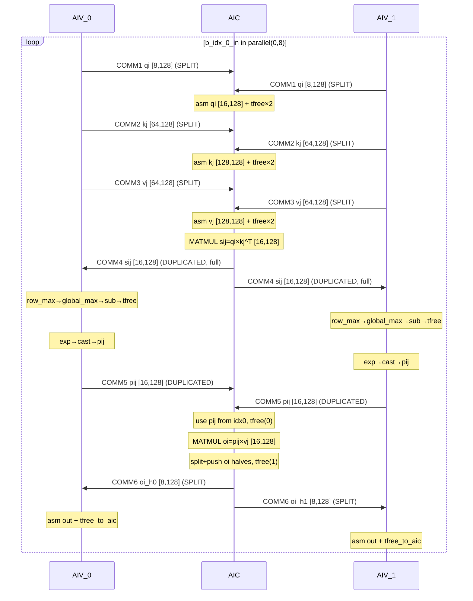

# Predicate Test Kernel Flow Analysis (pa5, Pass 08)

## Overview

The `ExpandMixedKernel` pass splits the `predicate_kernel_incore_0` mixed kernel into three co-scheduled kernels. This is a simpler test case than pa4 — single loop level, no online rescaling, and includes a **duplicated variable** (unsplittable chain) demonstrating the `DUPLICATED` path.

**Kernel signatures:**

| Kernel | Core | Instances | Tensor sizes |
|--------|------|-----------|-------------|
| `predicate_kernel_incore_0_aic` | AIC (Cube) | 1× | Full-size: `[16, 128]`, `[128, 128]` |
| `predicate_kernel_incore_0_aiv` (AIV_IDX=0) | AIV (Vector 0) | 1× | Half/Full: `[8, 128]` / `[16, 128]` |
| `predicate_kernel_incore_0_aiv` (AIV_IDX=1) | AIV (Vector 1) | 1× | Half/Full: `[8, 128]` / `[16, 128]` |

**Communication protocol:** Each data transfer uses a 3-step split consumer protocol:
1. **tpush** — producer sends data into ring buffer slot
2. **tpop** — consumer acquires slot, loads data (slot remains **held**)
3. **tfree** — consumer releases slot after finishing all reads

---

## Side-by-Side Kernel Flow with Loop Boundaries

```
   AIV_0 (Vector 0)             │        AIC (Cube)              │   AIV_1 (Vector 1)
═════════════════════════════════╪═════════════════════════════════╪═════════════════════════════════
 init_pipe()                    │ init_pipe()                     │ init_pipe()
                                │                                 │
═══ LOOP START ═════════════════╪═════════════════════════════════╪═════════════════════════════════
 FOR b_idx_0_in                 │ FOR b_idx_0_in                  │ FOR b_idx_0_in
   IN parallel(0, 8)            │   IN parallel(0, 8)             │   IN parallel(0, 8)
 carry: out                     │ carry: out                      │ carry: out
────────────────────────────────┼─────────────────────────────────┼─────────────────────────────────
                                │                                 │
 qi = view(query, [8,128],      │                                 │ qi = view(query, [8,128],
   [off+IDX*8, 0])              │                                 │   [off+IDX*8, 0])
 tpush_to_aic(qi, 0)   COMM 1→ │ ←tpop(0)  qi_h0 [8,128]        │←COMM 1  tpush_to_aic(qi, 1)
                                │ ←tpop(1)  qi_h1 [8,128]        │
                                │ asm(qi_h0) → qi_mid             │
                                │ tfree_to_aiv(0)        FREE 1a  │
                                │ asm(qi_h1) → qi [16,128]        │
                                │ tfree_to_aiv(1)        FREE 1b  │
                                │                                 │
 kj = view(key, [64,128],       │                                 │ kj = view(key, [64,128],
   [IDX*64, 0])                 │                                 │   [IDX*64, 0])
 tpush_to_aic(kj, 0)   COMM 2→ │ ←tpop(0)+tpop(1)               │←COMM 2  tpush_to_aic(kj, 1)
                                │ asm + tfree(0) + tfree(1)       │
                                │   → kj [128,128]                │
                                │                                 │
 vj = view(val, [64,128],       │                                 │ vj = view(val, [64,128],
   [IDX*64, 0])                 │                                 │   [IDX*64, 0])
 tpush_to_aic(vj, 0)   COMM 3→ │ ←tpop(0)+tpop(1)               │←COMM 3  tpush_to_aic(vj, 1)
                                │ asm + tfree(0) + tfree(1)       │
                                │   → vj [128,128]                │
                                │                                 │
                                │ sij = matmul(qi, kj^T)          │
                                │   → [16,128]                    │
                                │ tpush_to_aiv(sij, 0)            │
                                │ tpush_to_aiv(sij, 1)            │
 tpop sij [16,128]    ←COMM 4  │                  COMM 4→        │ tpop sij [16,128]   ←COMM 4
 (DUPLICATED: full tensor)      │                                 │ (DUPLICATED: full tensor)
                                │                                 │
 SOFTMAX:                       │                                 │ SOFTMAX:
   mi_0 = row_max(sij)         │                                 │   mi_0 = row_max(sij)
   reshape mi_0 → [1,16]       │                                 │   reshape mi_0 → [1,16]
   global_max = row_max(mi_fl)  │                                 │   global_max = row_max(mi_fl)
   centered = sub(sij, g_max)   │                                 │   centered = sub(sij, g_max)
   tfree_to_aic()       FREE 4  │                                 │   tfree_to_aic()       FREE 4
   exp_v = exp(centered)        │                                 │   exp_v = exp(centered)
   pij = cast(exp_v, BF16)     │                                 │   pij = cast(exp_v, BF16)
                                │                                 │
 tpush_to_aic(pij, 0)  COMM 5→ │ ←tpop(0)  pij [16,128]         │←COMM 5  tpush_to_aic(pij, 1)
                                │ ←tpop(1)  pij_discard [16,128]  │
                                │ (DUPLICATED: use pij from idx 0)│
                                │                                 │
                                │ oi = matmul(pij, vj)            │
                                │   → [16,128]                    │
                                │ tfree_to_aiv(0)        FREE 5a  │
                                │ h0 = view(oi,[8,128],[0,0])     │
                                │ h1 = view(oi,[8,128],[8,0])     │
                                │ tpush_to_aiv(h0, 0)             │
                                │ tpush_to_aiv(h1, 1)             │
                                │ tfree_to_aiv(1)        FREE 5b  │
                                │                                 │
 tpop oi [8,128]      ←COMM 6  │                  COMM 6→        │ tpop oi [8,128]     ←COMM 6
 asm out[off+IDX*8,:] = oi      │                                 │ asm out[off+IDX*8,:] = oi
 tfree_to_aic(IDX)      FREE 6  │                                 │ tfree_to_aic(IDX)    FREE 6
                                │                                 │
 yield: out                     │                                 │ yield: out
────────────────────────────────┼─────────────────────────────────┼─────────────────────────────────
═══ LOOP END ═══════════════════╪═════════════════════════════════╪═════════════════════════════════
 END FOR b_idx_0_in              │ END FOR b_idx_0_in               │ END FOR b_idx_0_in
```

---

## Cross-Kernel Communication Summary (per iteration)

```
 COMM  Direction    AIV (each core)               AIC                              Var    Shape          Split?      tfree
 ────  ─────────    ─────────────────────────     ──────────────────────────────   ─────  ─────────────  ──────────  ──────────────
  1    AIV → AIC    tpush(qi, IDX)                tpop×2 + asm + tfree×2          qi     [8,128]→[16]   SPLIT ax0   AIC: after asm
  2    AIV → AIC    tpush(kj, IDX)                tpop×2 + asm + tfree×2          kj     [64,128]→[128] SPLIT ax0   AIC: after asm
  3    AIV → AIC    tpush(vj, IDX)                tpop×2 + asm + tfree×2          vj     [64,128]→[128] SPLIT ax0   AIC: after asm
  4    AIC → AIV    tpop → sij [16,128]           tpush×2 (full tensor to both)   sij    [16,128] full  DUPLICATED  AIV: after sub
  5    AIV → AIC    tpush(pij, IDX)               tpop×2 (use idx 0 only)         pij    [16,128] full  DUPLICATED  AIC: after matmul / end
  6    AIC → AIV    tpop(IDX) → oi [8,128]        view+split + tpush×2            oi     [16,128]→[8]   SPLIT ax0   AIV: after asm
```

---

## Detailed Operation Trace

### AIC Kernel — Detailed Operations (loop body)

```
 Step  Operation                          Output Shape         Slot lifecycle
 ────  ─────────────────────────────────  ──────────────────   ──────────────
  1    tpop_from_aiv(0)                   qi_h0 [8,128]        ▶ slot held
  2    tpop_from_aiv(1)                   qi_h1 [8,128]        ▶ slot held
  3    create([16,128])                   qi_tmp
  4    assemble(qi_tmp, qi_h0, [0,0])     qi_mid [16,128]
  5    tfree_to_aiv(0)                    ─                    ◀ slot 0 released
  6    assemble(qi_mid, qi_h1, [8,0])     qi [16,128]
  7    tfree_to_aiv(1)                    ─                    ◀ slot 1 released
  8    tpop_from_aiv(0)                   kj_h0 [64,128]       ▶ slot held
  9    tpop_from_aiv(1)                   kj_h1 [64,128]       ▶ slot held
 10    create+assemble                    kj_mid
 11    tfree_to_aiv(0)                    ─                    ◀ slot 0 released
 12    assemble → kj [128,128]
 13    tfree_to_aiv(1)                    ─                    ◀ slot 1 released
 14    tpop_from_aiv(0)                   vj_h0 [64,128]       ▶ slot held
 15    tpop_from_aiv(1)                   vj_h1 [64,128]       ▶ slot held
 16    create+assemble                    vj_mid
 17    tfree_to_aiv(0)                    ─                    ◀ slot 0 released
 18    assemble → vj [128,128]
 19    tfree_to_aiv(1)                    ─                    ◀ slot 1 released
 20    matmul(qi, kj, b_trans=True)       sij [16,128]
 21    tpush_to_aiv(sij, 0)              ─  (full, DUPLICATED)
 22    tpush_to_aiv(sij, 1)              ─  (full, DUPLICATED)
 23    tpop_from_aiv(0)                   pij [16,128]         ▶ slot held (DUPLICATED)
 24    tpop_from_aiv(1)                   pij_discard [16,128]  ▶ slot held (discard)
 25    matmul(pij, vj)                    oi [16,128]
 26    tfree_to_aiv(0)                    ─                    ◀ slot 0 released (after last use)
 27    view(oi, [8,128], [0,0])           h0 [8,128]
 28    view(oi, [8,128], [8,0])           h1 [8,128]
 29    tpush_to_aiv(h0, 0)               ─
 30    tpush_to_aiv(h1, 1)               ─
 31    tfree_to_aiv(1)                    ─                    ◀ slot 1 released (discard, fallback)
```

### AIV Kernel (AIV_IDX=0 or 1) — Detailed Operations (loop body)

```
 Step  Operation                             Output Shape       Slot lifecycle
 ────  ────────────────────────────────────  ────────────────   ──────────────
  1    view(query, [8,128], [off+IDX*8,0])   qi [8,128]
  2    tpush_to_aic(qi, AIV_IDX)             ─
  3    view(key, [64,128], [IDX*64,0])       kj [64,128]
  4    tpush_to_aic(kj, AIV_IDX)             ─
  5    view(value, [64,128], [IDX*64,0])     vj [64,128]
  6    tpush_to_aic(vj, AIV_IDX)             ─
  7    tpop_from_aic()                       sij [16,128]       ▶ slot held (DUPLICATED, no IDX)
  8    row_max(sij)                          mi_0 [16,1]
  9    deep_reshape(mi_0, [1,16])            mi_flat [1,16]
 10    row_max(mi_flat)                      global_max [1,1]
 11    sub(sij, global_max)                  centered [16,128]   ← last use of sij
 12    tfree_to_aic()                        ─                  ◀ slot released
 13    exp(centered)                         exp_vals [16,128]
 14    cast(exp_vals, BF16)                  pij [16,128]
 15    tpush_to_aic(pij, AIV_IDX)            ─
 16    tpop_from_aic(AIV_IDX)                oi [8,128]         ▶ slot held (SPLIT)
 17    assemble(out, oi, [off+IDX*8,0])      out [64,128]       ← last use of oi
 18    tfree_to_aic(AIV_IDX)                 ─                  ◀ slot released
 19    yield: out
```

---

## Split vs. Duplicated Variables

pa5 demonstrates both splitting strategies:

| Chain | Variables | Strategy | Reason |
|-------|-----------|----------|--------|
| SPLIT chains | qi, kj, vj, oi, h0, h1 | SPLIT axis 0 | Dimension 0 evenly divisible by 2 |
| DUPLICATED chain | sij, mi_0, mi_flat, global_max, centered, exp_vals, pij | DUPLICATED | `row_max` on sij requires all rows; `global_max = row_max(row_max(sij))` reduces across the full tensor |

**Why sij is DUPLICATED:** The softmax pipeline computes `global_max = row_max(mi_flat)` where `mi_flat` is a reshaped `row_max(sij)`. This creates a reduction across all 16 rows, making it impossible to split `sij` on axis 0 — each half would produce a different `global_max`, leading to incorrect softmax normalization. The compiler correctly identifies this and marks the entire chain as DUPLICATED.

**DUPLICATED handling in AIC:**
- `tpush_to_aiv(sij, 0)` and `tpush_to_aiv(sij, 1)` — AIC sends the **same full tensor** to both AIV cores
- `tpop_from_aiv(0)` gets `pij`, `tpop_from_aiv(1)` gets `pij_discard` — AIC only uses the copy from core 0 (both are identical)
- `tfree_to_aiv(1)` is placed at end of block as a **fallback** since `pij_discard` is never used

---

## Mermaid Sequence Diagram



---

## Comparison with pa4

| Aspect | pa4 (PagedAttention) | pa5 (Predicate Test) |
|--------|---------------------|---------------------|
| Loop nesting | 3 levels (b_idx, q_idx, bn_0) | 1 level (b_idx_0_in) |
| Inner loop | Dynamic range(0, bn_this_batch) | Fixed parallel(0, 8) |
| Comm pairs | 6 (all SPLIT) | 6 (4 SPLIT + 2 DUPLICATED) |
| Duplicated vars | 0 | 7 (sij softmax chain) |
| Split vars | 50 across 17 chains | Both split and dup chains |
| Online rescaling | Yes (if bn_0 > 0) | No |
| oi_tmp slot hold | Long (across if/else rescale) | Short (1 assemble) |
| tfree count (AIC) | 8 per iteration | 8 per iteration (incl. discard fallback) |
| tfree count (AIV) | 2 per iteration | 2 per iteration |
